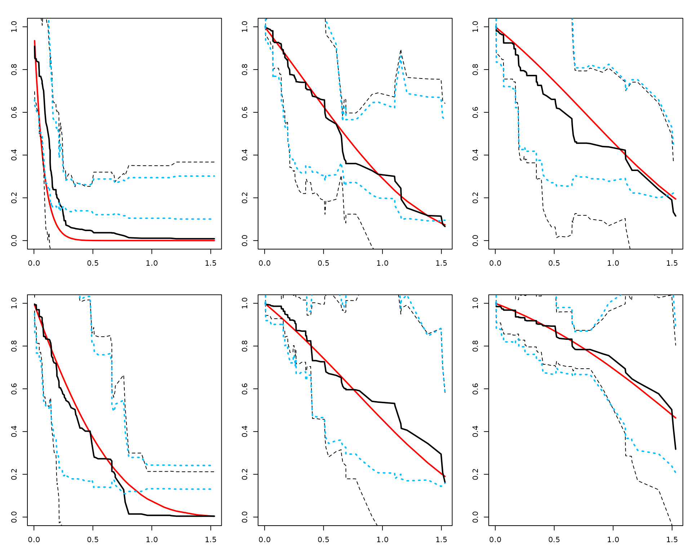
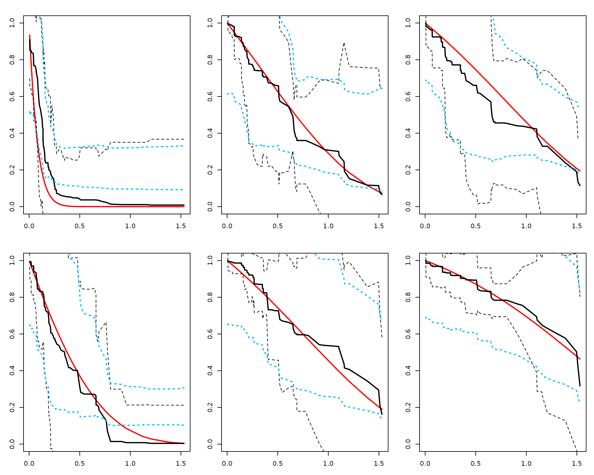

# Confidence Interval / Band - Survival Tutorial (RLT)

## Overview

This page shows how to construct confidence bands for individual
survival curves predicted by RLT.

## Data

We simulate right-censored survival data with standard normal
predictors.

``` r

# (Optional) For reproducibility in this tutorial only
set.seed(2)

# ---- Generate a small survival dataset (~120 obs) ----
n <- 120
p <- 10
X <- matrix(rnorm(n * p), n, p)

xlink <- function(x) exp(x[, 1] + x[, 3] / 2)
FT <- rexp(n, rate = xlink(X))          # event times
CT <- pmin(6, rexp(n, rate = 0.25))     # censoring times (cap at 6)

Y <- pmin(FT, CT)                        # observed time
Censor <- as.numeric(FT <= CT)           # 1 = event observed

# A few test subjects to visualize (keep small for a clean figure)
ntest  <- 6
testX  <- matrix(rnorm(ntest * p), ntest, p)

# True survival for reference (only for simulated data)
timepoints <- sort(unique(Y[Censor == 1]))
SurvMat    <- matrix(NA, nrow(testX), length(timepoints))
exprate    <- xlink(testX)

for (j in seq_along(timepoints)) {
  SurvMat[, j] <- 1 - pexp(timepoints[j], rate = exprate)
}
```

## Fit and predict with variance

``` r

# install.packages("devtools"); devtools::install_github("teazrq/RLT")
library(RLT)

fit <- RLT(
  X, Y, Censor, model = "survival",
  ntrees = 200, mtry = min(p, 10), nmin = 5,
  split.gen = "random", nsplit = 3,
  resample.prob = 0.8, resample.replace = FALSE,
  importance = FALSE, verbose = FALSE,
  ncores = 1,
  var.mode = "matched",
  param.control = list(split.rule = "logrank")
)

# Predict survival curves and covariance for test subjects
RLTPred <- predict(fit, testX, var.est = TRUE, ncores = 1)
```

## Option A — Naive Monte Carlo

This option computes bands using a Monte Carlo scheme with the
covariance estimate. We also plot pointwise ±1.96 \* sd from the
diagonal of the covariance for reference.

``` r

alpha <- 0.05
logt  <- log(1 + timepoints)

SurvBand_A <- get.surv.band(RLTPred, alpha = alpha, approach = "naive")

layout(matrix(1:ntest, nrow = 2, byrow = TRUE))
par(mar = c(3, 3, 2, 1))
for (i in 1:ntest) {
  # truth (red) — only available here because data are simulated
  plot(logt, SurvMat[i, ], type = "l", lwd = 2, col = "red",
       xlab = "log(1 + time)", ylab = paste("Subject", i),
       ylim = c(0, 1))
  
  # estimated survival (black solid) and pointwise 1.96 bands (black dotted)
  lines(logt, RLTPred$Survival[i, ], lwd = 2, col = "black")
  lines(logt, RLTPred$Survival[i, ] - qnorm(1 - alpha/2) * sqrt(diag(RLTPred$Cov[,, i])),
        lty = 2, col = "black")
  lines(logt, RLTPred$Survival[i, ] + qnorm(1 - alpha/2) * sqrt(diag(RLTPred$Cov[,, i])),
        lty = 2, col = "black")
  
  # naive band (blue dotted)
  lines(logt, as.numeric(SurvBand_A[[i]]$lower), lty = 3, lwd = 2, col = "deepskyblue")
  lines(logt, as.numeric(SurvBand_A[[i]]$upper), lty = 3, lwd = 2, col = "deepskyblue")
}
```



## Option B — Smoothed covariance

This option builds smoothed bands which can be more stable. Here we use
a small rank for illustration.

``` r

alpha <- 0.05
logt  <- log(1 + timepoints)

SurvBand_B <- get.surv.band(RLTPred, alpha = alpha, approach = "smoothed", k_rank = 5)

layout(matrix(1:ntest, nrow = 2, byrow = TRUE))
par(mar = c(3, 3, 2, 1))
for (i in 1:ntest) {
  plot(logt, SurvMat[i, ], type = "l", lwd = 2, col = "red",
       xlab = "log(1 + time)", ylab = paste("Subject", i),
       ylim = c(0, 1))
  lines(logt, RLTPred$Survival[i, ], lwd = 2, col = "black")
  lines(logt, RLTPred$Survival[i, ] - qnorm(1 - alpha/2) * sqrt(diag(RLTPred$Cov[,, i])),
        lty = 2, col = "black")
  lines(logt, RLTPred$Survival[i, ] + qnorm(1 - alpha/2) * sqrt(diag(RLTPred$Cov[,, i])),
        lty = 2, col = "black")
  lines(logt, as.numeric(SurvBand_B[[i]]$lower), lty = 3, lwd = 2, col = "deepskyblue")
  lines(logt, as.numeric(SurvBand_B[[i]]$upper), lty = 3, lwd = 2, col = "deepskyblue")
}
```



## (Optional) Proportion-selected smoothing

For completeness, the smoothed approach can choose the rank by
cumulative eigenvalue proportion:

``` r

SurvBand_C <- get.surv.band(
  RLTPred, alpha = 0.05,
  approach = "smoothed",
  k_mode = "proportion",
  k_prop = 0.95
)
```

You can increase `nsim` for stability at the cost of runtime.
