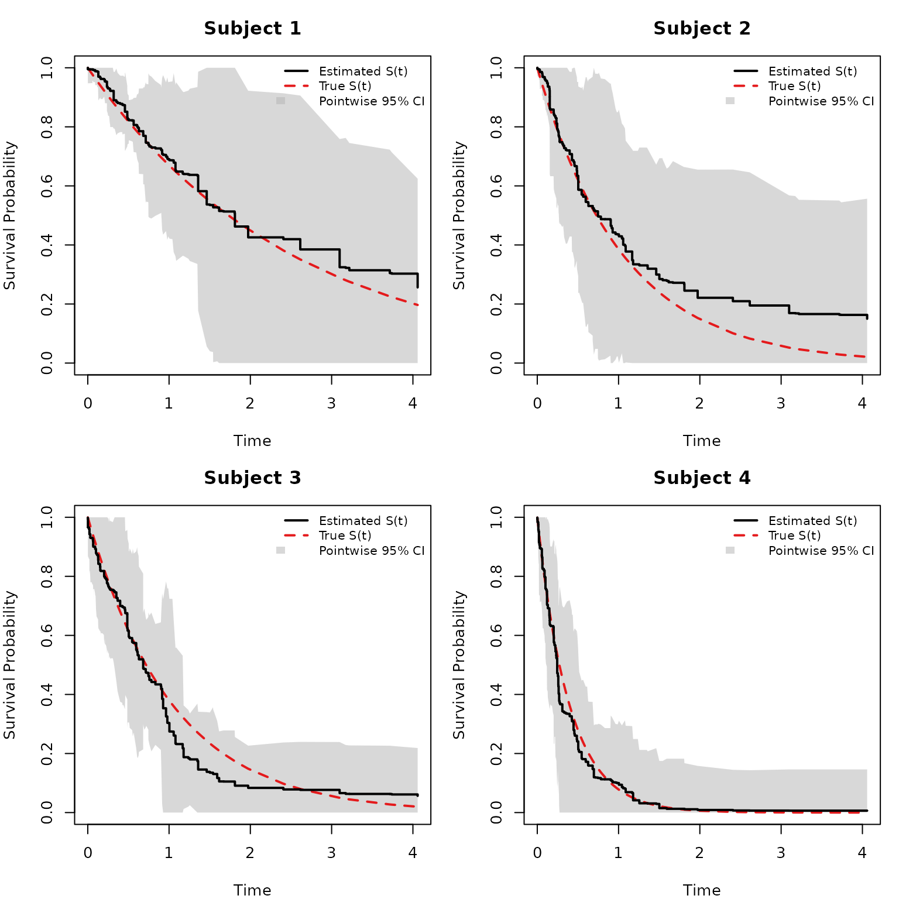
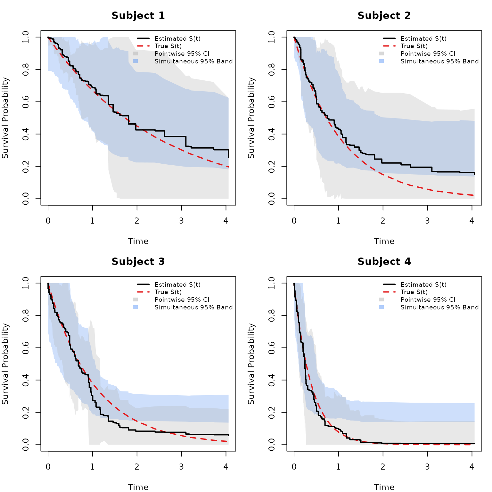

# Confidence Interval and Confidence Band — Survival Tutorial (RLT)

``` r

library(RLT)
```

## Overview

This page demonstrates how to construct **pointwise confidence
intervals** and **simultaneous confidence bands** for individual
survival curves predicted by RLT. The bands use a smoothed low-rank
covariance approach — GAM-smoothed eigenvalue decomposition plus an
eigenvalue-ratio weighted residual correction — which produces stable,
well-calibrated bands even when the number of time points is large
relative to the number of trees.

## Data

We simulate right-censored survival data from a proportional hazards
model with exponential event times. The first and third predictors carry
signal; the rest are noise.

``` r

set.seed(2)

n <- 200
p <- 10
X <- matrix(rnorm(n * p), n, p)

xlink <- function(x) exp(x[, 1] + x[, 3] / 2)
FT <- rexp(n, rate = xlink(X))
CT <- pmin(6, rexp(n, rate = 0.25))

Y <- pmin(FT, CT)
Censor <- as.numeric(FT <= CT)

# Test subjects for visualization
ntest  <- 4
set.seed(100)
testX  <- matrix(rnorm(ntest * p), ntest, p)

# True survival for reference
timepoints <- sort(unique(Y[Censor == 1]))
SurvMat    <- matrix(NA, nrow(testX), length(timepoints))
exprate    <- xlink(testX)
for (j in seq_along(timepoints)) {
  SurvMat[, j] <- 1 - pexp(timepoints[j], rate = exprate)
}
```

## Fit and predict with variance

We use `var.mode = "matched"` (matched-sample U-statistic) for variance
estimation. This automatically adjusts sampling to subsampling without
replacement at 50%.

``` r

fit <- RLT(
  X, Y, Censor, model = "survival",
  ntrees = 1000, mtry = min(p, 10), nmin = 5,
  split.gen = "random", nsplit = 3,
  resample.prob = 0.8, resample.replace = FALSE,
  importance = FALSE, verbose = FALSE,
  ncores = 1,
  var.mode = "matched",
  param.control = list(split.rule = "logrank")
)

# Predict survival curves and covariance for test subjects
RLTPred <- predict(fit, testX, var.est = TRUE, ncores = 1)
```

## Pointwise confidence intervals

Before constructing simultaneous bands, it is useful to look at
pointwise intervals ($`\pm 1.96 \times \text{SD}`$ from the diagonal of
the covariance matrix). These are **not** simultaneous — each time point
is considered independently.

``` r

par(mfrow = c(2, 2), mar = c(4, 4, 3, 1))

for (i in 1:ntest) {
  tp  <- RLTPred$timepoints
  S   <- pmin(pmax(as.numeric(RLTPred$Survival[i, ]), 0), 1)
  sd_i <- sqrt(diag(RLTPred$Cov[,, i]))
  pw_lower <- pmin(pmax(S - qnorm(0.975) * sd_i, 0), 1)
  pw_upper <- pmin(pmax(S + qnorm(0.975) * sd_i, 0), 1)
  truth <- as.numeric(SurvMat[i, ])
  
  # Plot estimate with shaded pointwise CI
  plot(tp, S, type = "n", ylim = c(0, 1),
       xlab = "Time", ylab = "Survival Probability",
       main = paste("Subject", i))
  
  # Shaded pointwise band
  polygon(c(tp, rev(tp)), c(pw_lower, rev(pw_upper)),
          col = rgb(0.7, 0.7, 0.7, 0.5), border = NA)
  
  # Truth (dashed red)
  lines(tp, truth, col = "#E41A1C", lwd = 2, lty = 2)
  
  # Estimate (step function, black)
  lines(tp, S, type = "s", lwd = 2)
  
  legend("topright", legend = c("Estimated S(t)", "True S(t)", "Pointwise 95% CI"),
         lty = c(1, 2, NA), lwd = c(2, 2, NA), col = c("black", "#E41A1C", NA),
         fill = c(NA, NA, rgb(0.7, 0.7, 0.7, 0.5)),
         border = c(NA, NA, NA),
         bty = "n", cex = 0.8)
}
```



``` r


par(mfrow = c(1, 1))
```

## Simultaneous confidence band

[`get.surv.band()`](https://teazrq.github.io/RLT/reference/get.surv.band.md)
with `approach = "smoothed"` constructs a simultaneous confidence band
using a GAM-smoothed low-rank approximation of the covariance matrix,
plus an eigenvalue-ratio weighted residual correction. The smoothed
approach is more stable than the naive Monte Carlo method, especially
when the number of time points is large.

``` r

SurvBand <- get.surv.band(RLTPred, alpha = 0.05, approach = "smoothed", k_rank = 10)
```

``` r

par(mfrow = c(2, 2), mar = c(4, 4, 3, 1))

for (i in 1:ntest) {
  tp  <- RLTPred$timepoints
  S   <- pmin(pmax(as.numeric(RLTPred$Survival[i, ]), 0), 1)
  sd_i <- sqrt(diag(RLTPred$Cov[,, i]))
  pw_lower <- pmin(pmax(S - qnorm(0.975) * sd_i, 0), 1)
  pw_upper <- pmin(pmax(S + qnorm(0.975) * sd_i, 0), 1)
  truth <- as.numeric(SurvMat[i, ])
  
  b_lower <- pmin(pmax(as.numeric(SurvBand[[i]]$lower), 0), 1)
  b_upper <- pmin(pmax(as.numeric(SurvBand[[i]]$upper), 0), 1)
  
  plot(tp, S, type = "n", ylim = c(0, 1),
       xlab = "Time", ylab = "Survival Probability",
       main = paste("Subject", i))
  
  # Shaded simultaneous band (blue)
  polygon(c(tp, rev(tp)), c(b_lower, rev(b_upper)),
          col = rgb(0.23, 0.51, 0.96, 0.25), border = NA)
  
  # Shaded pointwise band (grey)
  polygon(c(tp, rev(tp)), c(pw_lower, rev(pw_upper)),
          col = rgb(0.7, 0.7, 0.7, 0.3), border = NA)
  
  # Truth (dashed red)
  lines(tp, truth, col = "#E41A1C", lwd = 2, lty = 2)
  
  # Estimate (step function, black)
  lines(tp, S, type = "s", lwd = 2)
  
  legend("topright",
         legend = c("Estimated S(t)", "True S(t)",
                    "Pointwise 95% CI", "Simultaneous 95% Band"),
         lty = c(1, 2, NA, NA), lwd = c(2, 2, NA, NA),
         col = c("black", "#E41A1C", NA, NA),
         fill = c(NA, NA, rgb(0.7, 0.7, 0.7, 0.5), rgb(0.23, 0.51, 0.96, 0.4)),
         border = c(NA, NA, NA, NA),
         bty = "n", cex = 0.75)
}
```



``` r


par(mfrow = c(1, 1))
```

## (Optional) Proportion-selected smoothing

The smoothed approach can also choose the rank by cumulative eigenvalue
proportion instead of a fixed `k_rank`:

``` r

SurvBand_prop <- get.surv.band(
  RLTPred, alpha = 0.05,
  approach = "smoothed",
  k_mode = "proportion",
  k_prop = 0.95
)
```

You can increase `nsim` for stability at the cost of runtime.

## (Optional) Reducing the time grid

For large datasets, the full set of failure times can make covariance
matrices unwieldy. Use `band.grid.size` in
[`predict()`](https://rdrr.io/r/stats/predict.html) to evaluate variance
on a reduced quantile-based grid:

``` r

pred_reduced <- predict(fit, testX, var.est = TRUE, band.grid.size = 50)
length(pred_reduced$timepoints)  # <= 50 time points
```
