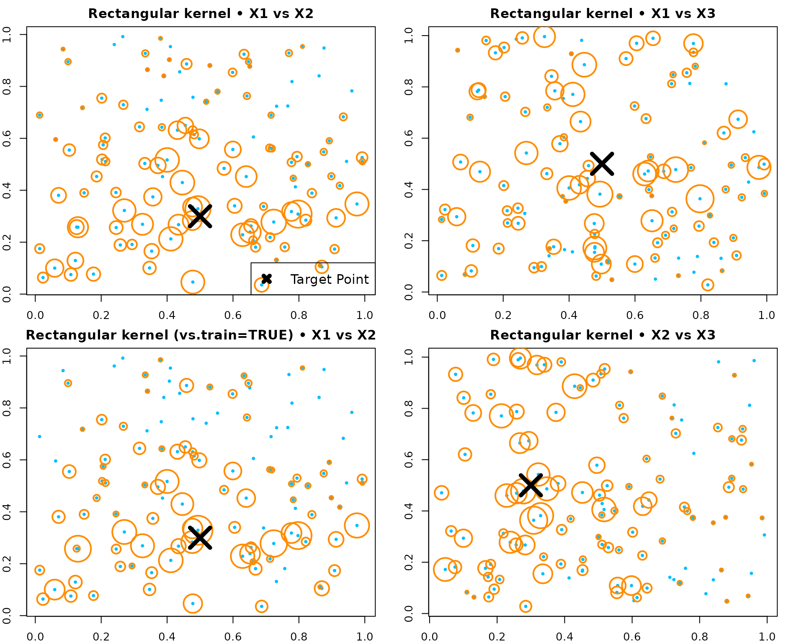
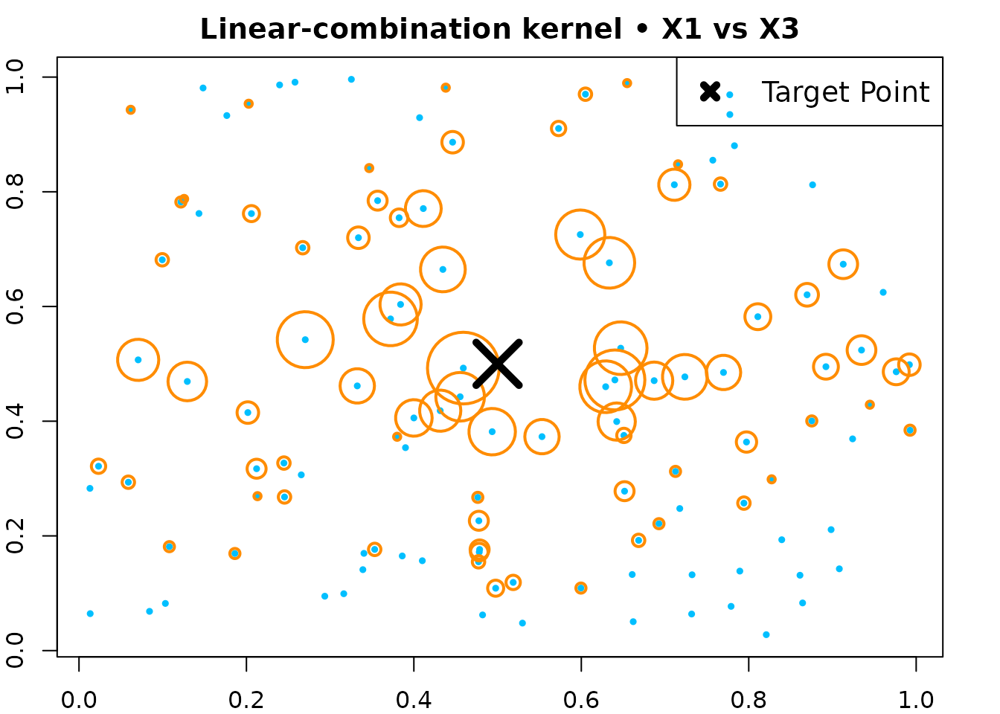

# Kernel - Tutorial (RLT)

## Overview

This page shows how to compute and visualize the random forest kernel
induced by an RLT forest via
[`forest.kernel()`](https://teazrq.github.io/RLT/reference/forest.kernel.md).

## Example 1 — Axis-aligned

We build a regression forest using “best” splits and compute kernel
weights.

``` r

# ---- Generate a small dataset (≈100 obs) ----
set.seed(1)
n <- 120; p <- 5
X <- matrix(runif(n * p), n, p)
y <- X[, 1] + X[, 2] + rnorm(n)

# Train the forest (axis-aligned "best" splits)
library(RLT)
fit_rect <- RLT(
  X, y, model = "regression",
  ntrees = 300, mtry = p, nmin = 5,
  split.gen = "best",
  resample.prob = 0.8, resample.replace = TRUE,
  importance = TRUE,
  param.control = list("resample.track" = TRUE),
  ncores = 1,
  verbose = FALSE
)

# Choose a target point
newX <- matrix(c(0.5, 0.3, 0.5, 0.5, 0.5), 1, p)

# Forest kernel weights between newX and all X
KW_rect <- forest.kernel(fit_rect, X1 = newX, X2 = X)$Kernel

# A simple size mapping for visualization (normalized)
size_scale <- 10 * sqrt(KW_rect / sqrt(sum(KW_rect^2)))
```

``` r

op <- par(mfrow = c(2, 2), mar = c(2, 2, 2, 2))

# X1 vs X2 (both are signal features)
plot(X[, 1], X[, 2], col = "deepskyblue", pch = 19, cex = 0.5,
     main = "Rectangular kernel • X1 vs X2")
points(X[, 1], X[, 2], col = "darkorange", cex = size_scale, lwd = 2)
points(newX[1], newX[2], col = "black", pch = 4, cex = 4, lwd = 5)
legend("bottomright", "Target Point", pch = 4, col = "black", lwd = 5, lty = NA, cex = 1.2)

# X1 vs X3 (X3 is noise)
plot(X[, 1], X[, 3], col = "deepskyblue", pch = 19, cex = 0.5,
     main = "Rectangular kernel • X1 vs X3")
points(X[, 1], X[, 3], col = "darkorange", cex = size_scale, lwd = 2)
points(newX[1], newX[3], col = "black", pch = 4, cex = 4, lwd = 5)

# Optionally, compute kernel inside the original training forest (vs.train = TRUE)
KW_rect_train <- forest.kernel(fit_rect, X1 = newX, X2 = X, vs.train = TRUE)$Kernel
size_scale_train <- 10 * sqrt(KW_rect_train / sqrt(sum(KW_rect_train^2)))
plot(X[, 1], X[, 2], col = "deepskyblue", pch = 19, cex = 0.5,
     main = "Rectangular kernel (vs.train=TRUE) • X1 vs X2")
points(X[, 1], X[, 2], col = "darkorange", cex = size_scale_train, lwd = 2)
points(newX[1], newX[2], col = "black", pch = 4, cex = 4, lwd = 5)

# Another projection
plot(X[, 2], X[, 3], col = "deepskyblue", pch = 19, cex = 0.5,
     main = "Rectangular kernel • X2 vs X3")
points(X[, 2], X[, 3], col = "darkorange", cex = size_scale, lwd = 2)
points(newX[2], newX[3], col = "black", pch = 4, cex = 4, lwd = 5)
```



``` r


par(op)
```

## Example 2 — Linear-combination

We build a regression forest using random linear-combination splits and
compute kernel weights.

``` r

set.seed(1)
n <- 120; p <- 5
X <- matrix(runif(n * p), n, p)
y <- X[, 1] + X[, 3] + 0.3 * rnorm(n)

fit_lc <- RLT(
  X, y, model = "regression",
  ntrees = 300, mtry = p, nmin = 5,
  split.gen = "random", nsplit = 3,
  resample.prob = 0.9, resample.replace = FALSE,
  importance = TRUE,
  ncores = 1,
  verbose = FALSE
)

newX <- matrix(c(0.5, 0.3, 0.5, 0.5, 0.5), 1, p)
KW_lc <- forest.kernel(fit_lc, X1 = newX, X2 = X)$Kernel
size_scale_lc <- 10 * sqrt(KW_lc / sqrt(sum(KW_lc^2)))
```

``` r

par(mar = c(2, 2, 2, 2))
plot(X[, 1], X[, 3], col = "deepskyblue", pch = 19, cex = 0.5,
     main = "Linear-combination kernel • X1 vs X3")
points(X[, 1], X[, 3], col = "darkorange", cex = size_scale_lc, lwd = 2)
points(newX[1], newX[3], col = "black", pch = 4, cex = 4, lwd = 5)
legend("topright", "Target Point", pch = 4, col = "black", lwd = 5, lty = NA, cex = 1.2)
```



## Example 3 — Linear-combination (SIR, no embedded model)

Fit a model using linear-combination splits without an embedded forest;
variables are ranked by marginal screening.

``` r

library(MASS)
n <- 300
p <- 5
S <- matrix(0.3, p, p)
diag(S) <- 1
S[1, 5] <- S[5, 1] <- 0.9
S[1, 3] <- S[3, 1] <- S[5, 3] <- S[3, 5] <- -0.3

X <- mvrnorm(n, mu = rep(0, p), Sigma = S)
y <- 1 + X[, 1] + X[, 3] + 0.5 * X[, 5]^2 + rnorm(n)
w <- runif(n)

RLTfit <- RLT(
  X, y, model = "regression", obs.w = w,
  ntrees = 100, ncores = 1, nmin = 20, mtry = 3,
  split.gen = "random", nsplit = 3,
  resample.prob = 0.8, resample.replace = FALSE,
  linear.comb = 3,
  linear.comb.method = "sir",
  importance = TRUE,
  verbose = FALSE
)

plot(RLTfit$Prediction, y)
```


``` r

mean((RLTfit$Prediction - y)^2, na.rm = TRUE)
## [1] 1.283215
```
